# Colorful v2

A colorful EmulationStation theme adapted for small-screen handheld devices like the **R36S** (640x480 resolution) and other aspect ratio screens. It brings the vibrant, modern aesthetic of the popular **COLORFUL BigBox Theme** to retro handhelds running EmulationStation.

This theme is designed to be fully compatible with:
- **ArkOS**
- **AmberELEC**
- **Pan4ELEC**
- **DarkOS** requires [this script](https://drive.google.com/file/d/155CQvgzMv4DJE6ezFhuyWNSwvIpD-iHt/view?usp=sharing) to run the theme. The script rewrites the theme to be compatible with DarkOS. Install the theme first, then download the script and place it in /roms/tools/. Run it from Tools > Tools folder

## Original Inspiration

This is an adaptation/port of the **COLORFUL BigBox Theme** originally created by **Viking** (with contributions from the LaunchBox community, including code work by @faeran and others).

- Original project page: [COLORFUL BigBox Theme on LaunchBox Forums](https://forums.launchbox-app.com/files/file/2081-colorful-bigbox-theme/)
- Made with love in France – thanks to Viking for the amazing original work and for making it open source/community-accessible!

All assets and design elements from the original are used under **Fair Use** principles for non-commercial, transformative adaptation purposes (porting to a different frontend/resolution/platform with significant modifications for low-res handhelds). No trademarked logos or assets are claimed as original; they are retained only where necessary for the adapted experience and fall under fair use in this context.

## Key Adaptations for Handhelds

- Optimized for **640x480** resolution (native R36S screen) but other aspect ratios work – no stretching or black bars issues
- Scaled down fonts, layouts, and assets to remain readable and performant on small/low-res screens
- Retained the core colorful, elegant style with vibrant platform/system highlights
- Adjusted views (system select, game list, details) to fit handheld navigation

## Screenshots

- **System Selection Screen**

</a>
<a href="screenshots/Arcade_system.png">
  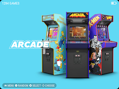
</a>
<a href="screenshots/ss_system.png">
  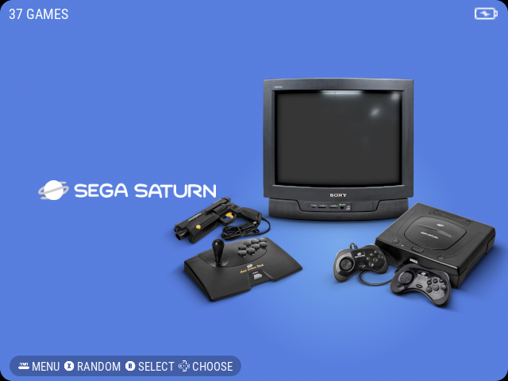
</a>
<a href="screenshots/PSP_system.png">
  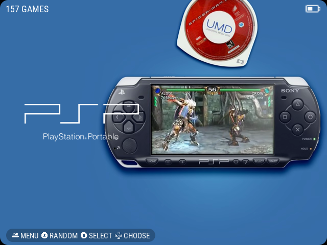
</a>  
   

- **Game List View**

</a>
<a href="screenshots/Arcade_gamelist.png">
  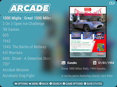
</a>
<a href="screenshots/ss_gamelist.png">
  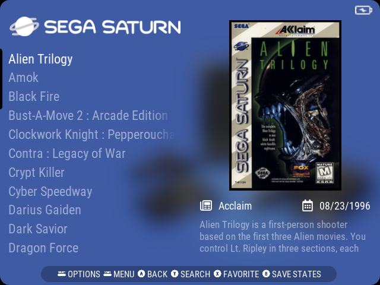
</a>
<a href="screenshots/PS_gamelist.png">
  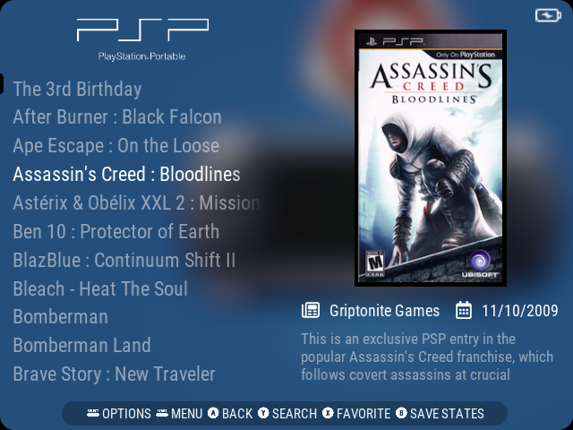
</a>
   

- **Customizable Tools Screen**
  
</a>
<a href="screenshots/u_screenshot_022.png">
  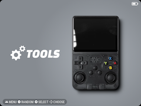
</a>
<a href="screenshots/u_screenshot_023.png">
  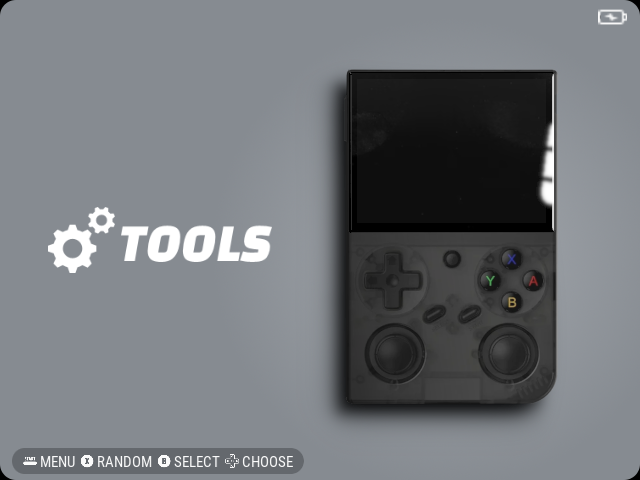
</a>
<a href="screenshots/u_screenshot_024.png">
  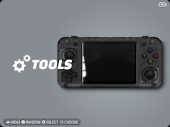
</a>
<a href="screenshots/u_screenshot_025.png">
  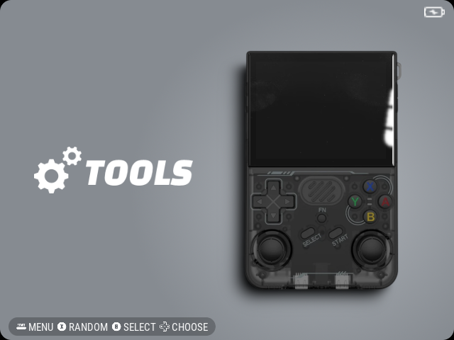
</a>
<a href="screenshots/u_screenshot_026.png">
  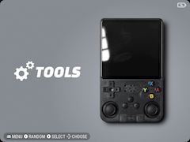
</a>
   

**Game List UI Options**</a>

<a href="screenshots/Glass_PSP.png">
&nbsp;&nbsp;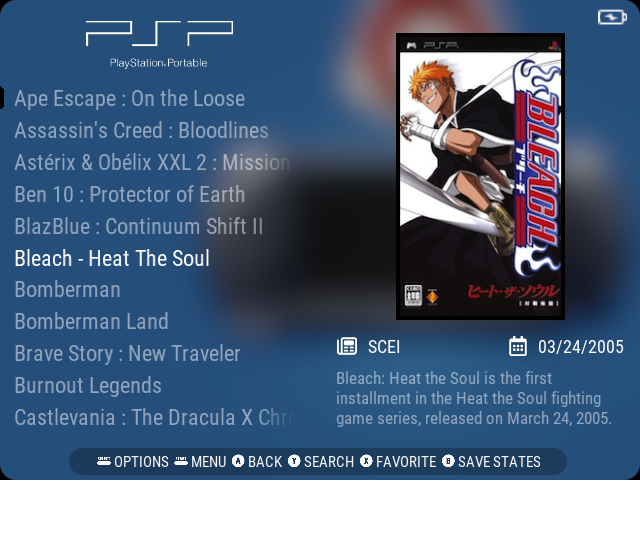
</a>
<a href="screenshots/Mangmi_PSP.png">
&nbsp;&nbsp;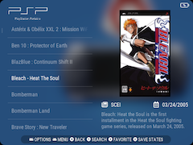
</a>
<a href="screenshots/Standard_PSP.png">
&nbsp;&nbsp;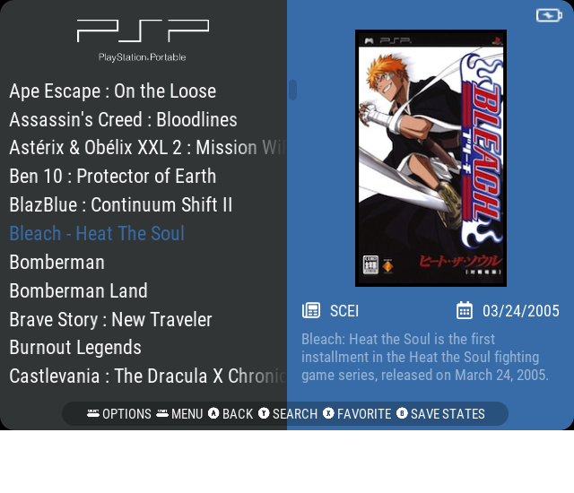
</a>
 
&nbsp;&nbsp;&nbsp;&nbsp;&nbsp;&nbsp;&nbsp;&nbsp;&nbsp;&nbsp;&nbsp;&nbsp;&nbsp;&nbsp;&nbsp;&nbsp;&nbsp;&nbsp;&nbsp;&nbsp;&nbsp;&nbsp;&nbsp;&nbsp;&nbsp;&nbsp;&nbsp;&nbsp;&nbsp;Glass&nbsp;&nbsp;&nbsp;&nbsp;&nbsp;&nbsp;&nbsp;&nbsp;&nbsp;&nbsp;&nbsp;&nbsp;&nbsp;&nbsp;&nbsp;&nbsp;&nbsp;&nbsp;&nbsp;&nbsp;&nbsp;&nbsp;&nbsp;&nbsp;&nbsp;&nbsp;&nbsp;&nbsp;&nbsp;&nbsp;&nbsp;&nbsp;&nbsp;&nbsp;&nbsp;&nbsp;&nbsp;&nbsp;&nbsp;&nbsp;&nbsp;&nbsp;&nbsp;&nbsp;&nbsp;&nbsp;&nbsp;&nbsp;&nbsp;&nbsp;&nbsp;&nbsp;&nbsp;&nbsp;Mangmi&nbsp;&nbsp;&nbsp;&nbsp;&nbsp;&nbsp;&nbsp;&nbsp;&nbsp;&nbsp;&nbsp;&nbsp;&nbsp;&nbsp;&nbsp;&nbsp;&nbsp;&nbsp;&nbsp;&nbsp;&nbsp;&nbsp;&nbsp;&nbsp;&nbsp;&nbsp;&nbsp;&nbsp;&nbsp;&nbsp;&nbsp;&nbsp;&nbsp;&nbsp;&nbsp;&nbsp;&nbsp;&nbsp;&nbsp;&nbsp;&nbsp;&nbsp;&nbsp;&nbsp;&nbsp;&nbsp;&nbsp;&nbsp;&nbsp;&nbsp;&nbsp;Standard
   

**Description Size Options**</a>

<a href="screenshots/small.png">
&nbsp;&nbsp;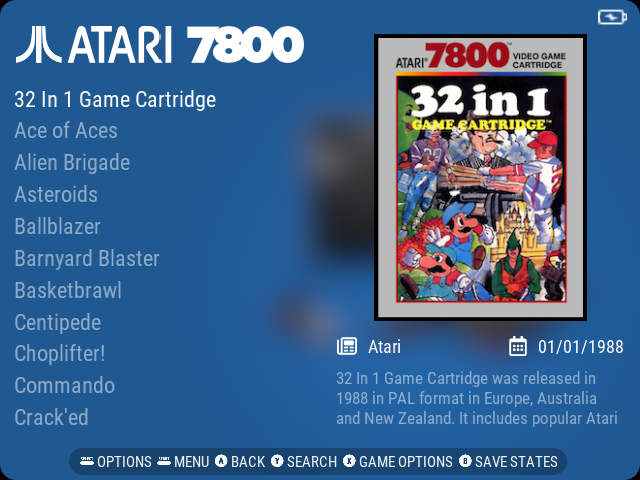
</a>
<a href="screenshots/med.png">
&nbsp;&nbsp;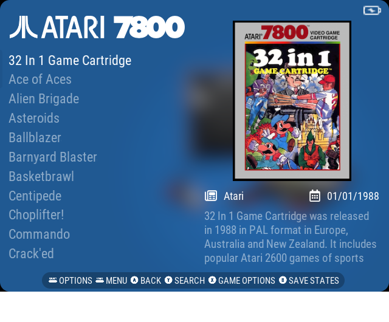
</a>
<a href="screenshots/large.png">
&nbsp;&nbsp;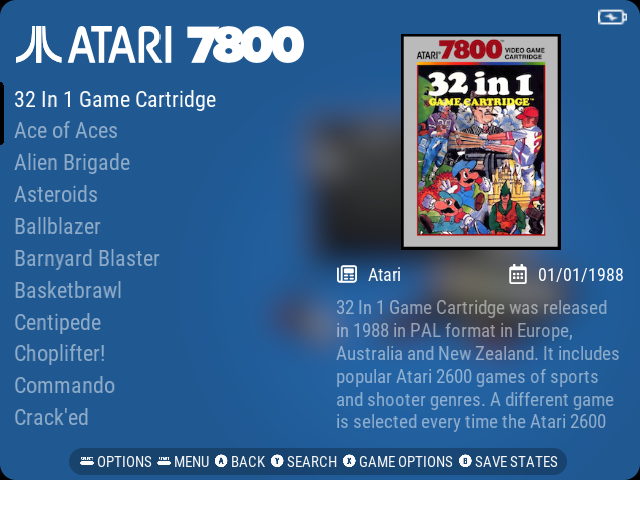
</a>
 
&nbsp;&nbsp;&nbsp;&nbsp;&nbsp;&nbsp;&nbsp;&nbsp;&nbsp;&nbsp;&nbsp;&nbsp;&nbsp;&nbsp;&nbsp;&nbsp;&nbsp;&nbsp;&nbsp;&nbsp;&nbsp;&nbsp;&nbsp;&nbsp;&nbsp;&nbsp;&nbsp;&nbsp;&nbsp;Small&nbsp;&nbsp;&nbsp;&nbsp;&nbsp;&nbsp;&nbsp;&nbsp;&nbsp;&nbsp;&nbsp;&nbsp;&nbsp;&nbsp;&nbsp;&nbsp;&nbsp;&nbsp;&nbsp;&nbsp;&nbsp;&nbsp;&nbsp;&nbsp;&nbsp;&nbsp;&nbsp;&nbsp;&nbsp;&nbsp;&nbsp;&nbsp;&nbsp;&nbsp;&nbsp;&nbsp;&nbsp;&nbsp;&nbsp;&nbsp;&nbsp;&nbsp;&nbsp;&nbsp;&nbsp;&nbsp;&nbsp;&nbsp;&nbsp;&nbsp;&nbsp;&nbsp;&nbsp;&nbsp;Medium&nbsp;&nbsp;&nbsp;&nbsp;&nbsp;&nbsp;&nbsp;&nbsp;&nbsp;&nbsp;&nbsp;&nbsp;&nbsp;&nbsp;&nbsp;&nbsp;&nbsp;&nbsp;&nbsp;&nbsp;&nbsp;&nbsp;&nbsp;&nbsp;&nbsp;&nbsp;&nbsp;&nbsp;&nbsp;&nbsp;&nbsp;&nbsp;&nbsp;&nbsp;&nbsp;&nbsp;&nbsp;&nbsp;&nbsp;&nbsp;&nbsp;&nbsp;&nbsp;&nbsp;&nbsp;&nbsp;&nbsp;&nbsp;&nbsp;&nbsp;&nbsp;&nbsp;&nbsp;&nbsp;Large
   

## Pan4ELEC Specific Features

  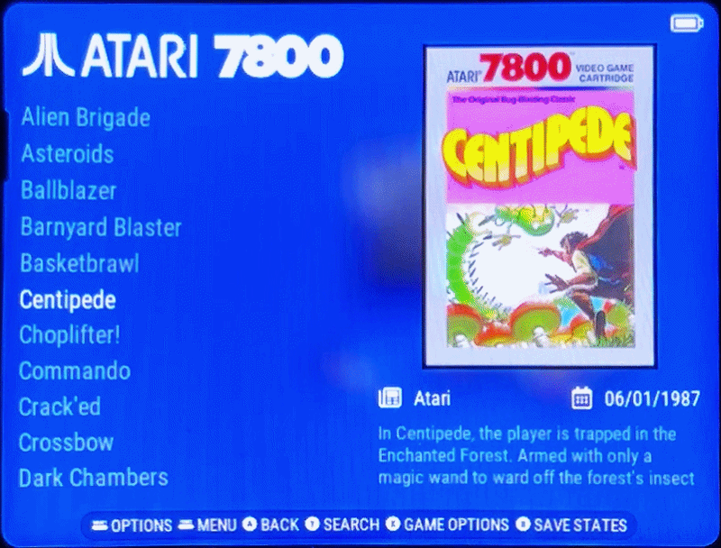

- **Dynamic Descriptions**  
  Storyboards enable smooth element animations. For example, the "Dynamic Description" feature in Pan4ELEC uses storyboards to expand and reposition the description text higher on the screen as the box art fades out and the video starts playing. This keeps the screen layout filled with no empty space at any point. (Note: It works best on consistent box art/video sizes; mixed systems like Favorites folders may not be perfect due to varying resolutions.)  
  **This feature is exclusive to Pan4ELEC and not available in ArkOS.**

- **Scrollbars**  
  As visible in many of the screenshots above, scrollbars appear in game lists and other views on Pan4ELEC only. ArkOS lacks native scrollbar support in its EmulationStation build.

## Contributing

Pull requests welcome! Especially for:
- Bug fixes
- Additional system views (or improve exisiting as I have not updated every system view from the original modified Colorful Theme)
- Devices for Tools screen

## License

This adaptation follows the spirit of the original COLORFUL theme (community/open sharing). Use, modify, and distribute freely for personal/non-commercial use. Credit Viking and the original contributors where possible.

Original COLORFUL BigBox Theme © Viking & LaunchBox community.

If you enjoy this, consider supporting the original creator on the LaunchBox forums!

Made for the retro handheld community – enjoy!
